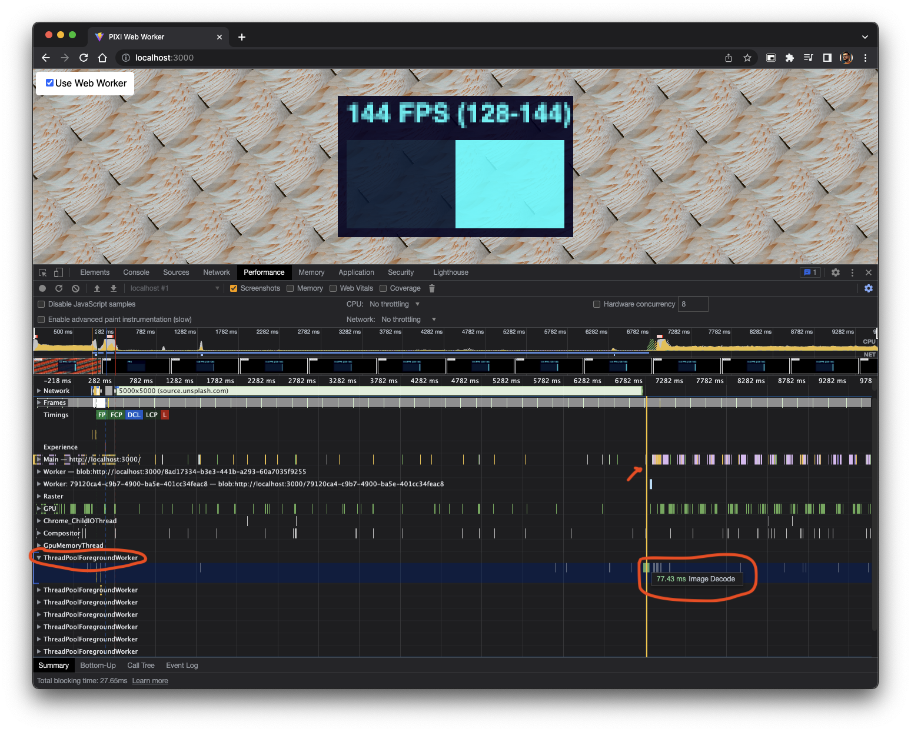
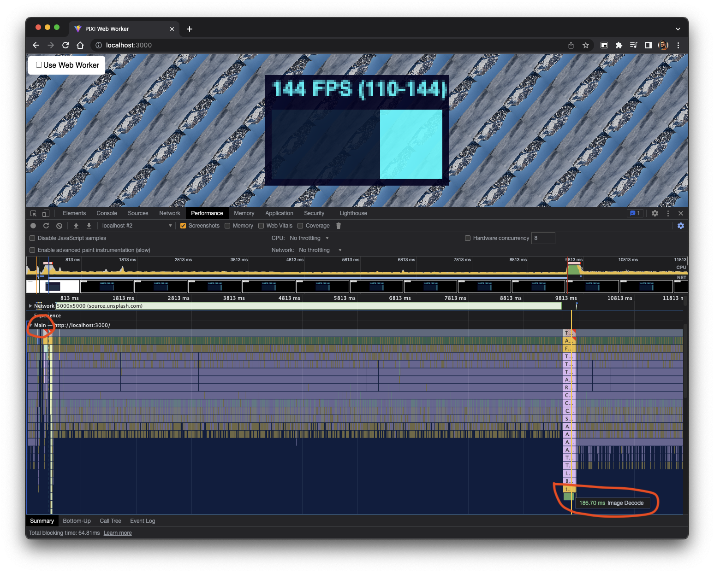

# Pixi.js image decoding in web worker

This repo demos decoding images in a web worker for [Pixi.js](https://pixijs.com/) for older browsers that don't support [`createImageBitmap`](https://developer.mozilla.org/en-US/docs/Web/API/createImageBitmap).

If you support modern browsers enabling pixijs.download/dev/docs/PIXI.settings.html#CREATE_IMAGE_BITMAP will automatically decode images in a seperate thread.

However.. If you are supporting older browsers, (say old TV devices) you may still want to decode images off the main thread so there is no FPS jank.

Web Worker supports is far better than `createImageBitmap`: https://caniuse.com/?search=createImageBitmap vs https://caniuse.com/?search=Web%20Workers

## Demo

To run the demo, clone the repo and run

```
npm run dev
```

Toggling the checkbox will reload the page and load and decode the image either using web workers or the main JS thread.


## Decoding using Web Worker



## Decoding using main thread

